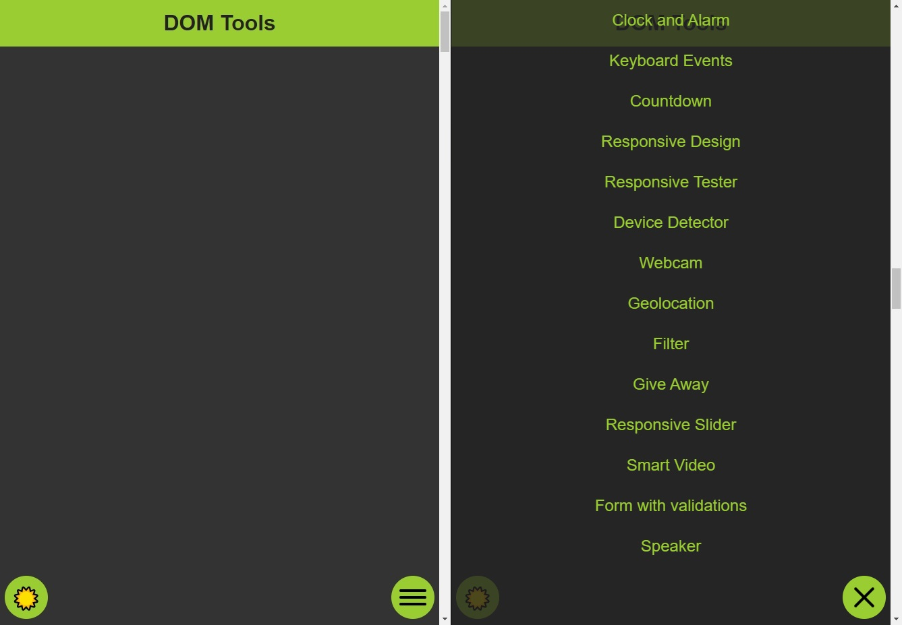
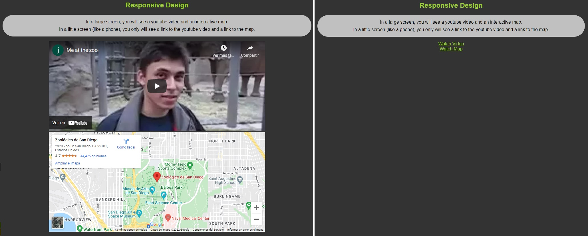
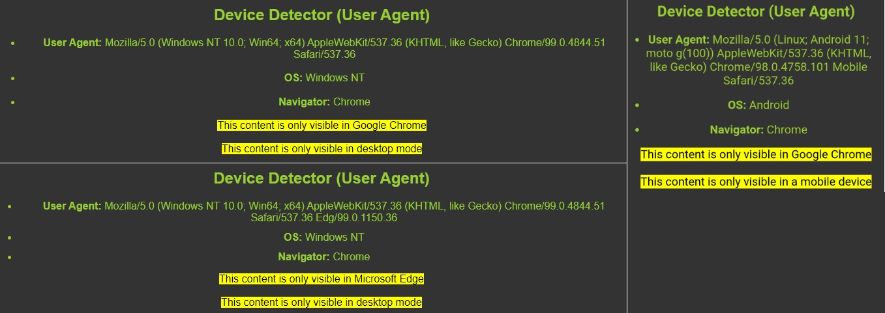
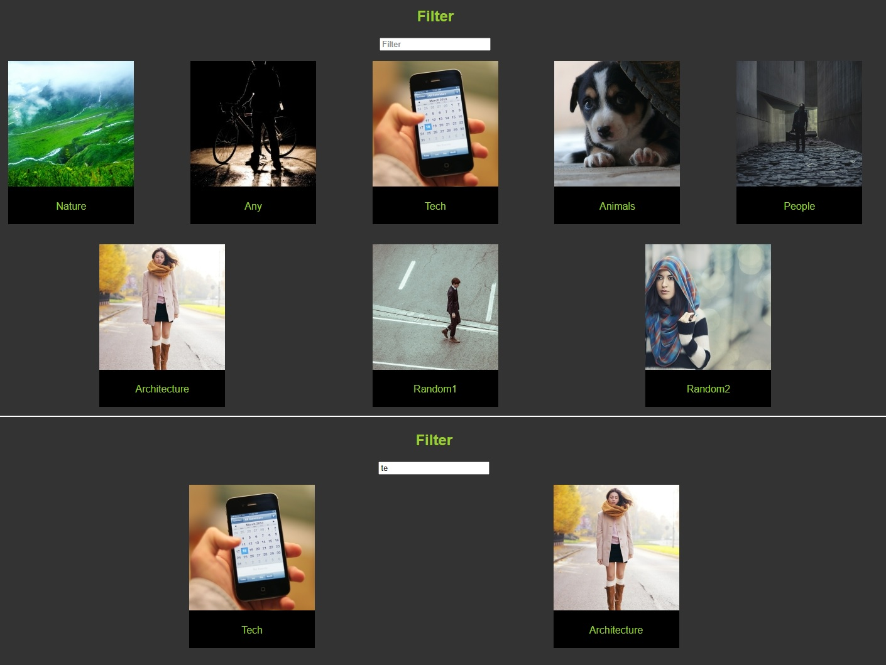

### Some tools that works with DOM in JavaScript and you will see in this repo:
* ***Hamurger_menu:*** When weight page is under 1240px, the menu will disapear and you can open it with a hamburger button.  

* ***Clock and Alarm:*** displays and hide a clock, run and stop an alarm.
* ***Keyboard Events:*** add shortcuts and interaction with keyboard inputs.
* ***Countdown:*** return a countdown to a determined date (in this case, my birthDay).
* ***Responsive Design:*** depending on sceen size, the page will load different content. It helps to get a better performance when you are on your phone with limited data.

* ***Responsive Tester:*** opens a new windows with the width and height in the form. It helps to knows how your page renders in an specific size.
* ***Device Detector (User Agent):*** detects the OS and browser from where the user is connected. Then shows different messages depending on it. 

* ***Connection Detector:*** it is a listener that, when you lost your connection gives an advise.  
* ***Webcam:*** capture image from webcam.
* ***Geolocation:*** gets device location.
* ***Filter:*** filter images depending on an input.

* ***Smart Video:*** start playing a video when the screen is over it... if you move the screen or change the window, the video will pause.
* ***Form With Validations:*** it's a form that displays errors depending on the input.

* ***Speaker:*** maked the browser talk depending on the language you choose.
* ***Scroll Observer*** hovers the menu section that the user is on the screen.
* ***Dark Mode:*** Dark mode theme.
* ***Scroll to Top Button:*** displays a button that moves the focus to the top of the page. 

[*] in mobile mode, webcam and geolocation only works with https protocols. Here it's a video who explanis how to do it: [Go to youtube video](https://www.youtube.com/watch?v=v4jgr0ppw8Q)

#### Demo:
* If you want to see a demo about how that funtionalities works, search the video "demo.mp4" in "assets/readme_assets" folder, or [clicking here](./assets/readme_assets/demo.mp4)

